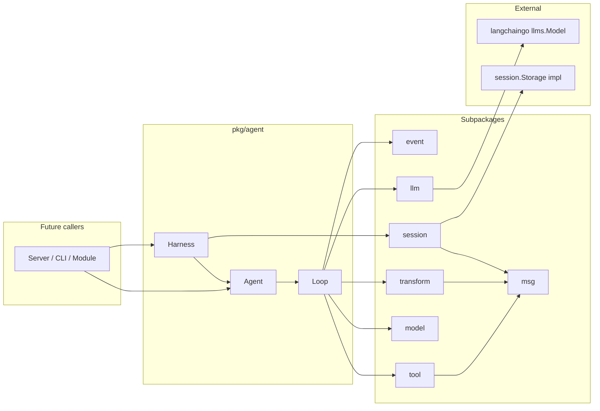

# Agent Engine Architecture

Reference implementation: [pi-agent-core](https://github.com/earendil-works/pi-agent) (TypeScript). Flowbot's Go port lives in `pkg/agent/` with langchaingo at the LLM boundary only.

## Position in Flowbot

```
Layer 3 — Business Logic
├── internal/modules/     # HTTP modules, cron, webhooks
├── pkg/workflow/       # DAG workflow runtime
├── pkg/pipeline/       # Event-driven pipelines
└── pkg/agent/          # Agent loop and LLM (pkg/agent/llm)
```

Modules that need one-shot classification or summarization import `pkg/agent/llm`. Callers that need tool loops, branching sessions, or streaming lifecycle events use the full `pkg/agent` runtime.

## Three-Layer Design

The runtime separates concerns the same way pi-agent-core does:

```
┌─────────────────────────────────────────────────────────┐
│  Harness (pkg/agent/harness)                            │
│  Session persistence, tool registry, lifecycle hooks    │
└──────────────────────────┬──────────────────────────────┘
                           │
┌──────────────────────────▼──────────────────────────────┐
│  Agent (pkg/agent/agent.go)                             │
│  Stateful wrapper: queues, subscribe, abort             │
└──────────────────────────┬──────────────────────────────┘
                           │
┌──────────────────────────▼──────────────────────────────┐
│  Loop (pkg/agent/loop.go, loop_inner.go)                │
│  Stateless Observe-Think-Act cycle                        │
└───────────────────────────────────────────────────────────┘
```

| Layer | Responsibility |
| ----- | -------------- |
| **Loop** | Send context to LLM, parse tool calls, execute tools, append results, repeat until done |
| **Agent** | Hold `Context`, steering/follow-up queues, `Subscribe()` handlers, cancellation |
| **Harness** | Wire session `Storage`, register tools, emit save-point hooks, gate concurrent runs |

## Observe-Think-Act Loop


### Loop controls

| Control | Config / behavior |
| ------- | ----------------- |
| **Max steps** | `Config.MaxSteps` (default 50) — prevents runaway self-iteration |
| **Cancellation** | `context.Context` — aborts LLM streaming and tool execution |
| **Tool batch mode** | `ToolExecutionParallel` (default) or `ToolExecutionSequential` |
| **Steering** | `Agent.Steer()` — inject messages between inner-loop turns |
| **Follow-up** | `Agent.FollowUp()` — inject after inner loop completes |

## Message Pipeline

Agent messages are **not** sent directly to the LLM. Two conversion stages mirror pi-agent-core:

```
[]msg.AgentMessage
    → TransformContext (optional hook)
    → []msg.AgentMessage
    → ConvertToLLM (default: transform.DefaultConvertToLLM)
    → []llms.MessageContent
    → langchaingo GenerateContent
```

Custom message types (`CustomMessage`, `BranchSummaryMessage`, `CompactionSummaryMessage`) are filtered or converted to user-visible text before the provider call. UI-only custom messages use `DisplayOnly` or `ExcludeFromContext`.

Shared types live in `pkg/agent/msg/` to avoid import cycles between `agent`, `tool`, `transform`, and `event`.

## Tool System

```
tool.Registry
  ├── Register(Tool)           # name must be unique
  ├── SetActive([]string)     # allowlist; empty = all registered
  └── ActiveTools()            # → []llms.Tool via tool.BuildLLMTools

tool.ExecuteBatch
  ├── prepareCall (sequential) # validate args, BeforeToolCall hook
  ├── execute (parallel/seq) # Tool.Execute(ctx, id, args, onUpdate)
  └── afterToolCall hook       # patch result, terminate hint
```

On failure, the executor appends a `ToolResultMessage` with `IsError: true` so the model can self-correct. Missing tools produce an error result referencing `msg.ErrToolNotFound`.

Reference tool: `pkg/agent/example/echo/`.

## Session Tree

Sessions are **append-only trees**, not linear chat arrays. Each node has `ID`, `ParentID`, and a typed entry:

| Entry type | Purpose |
| ---------- | ------- |
| `message` | User / assistant / tool result |
| `model_change` | Record model switch |
| `active_tools_change` | Record tool allowlist |
| `branch_summary` | Context after rollback to a branch |
| `compaction` | Summarized history; rebuilt via `BuildContext` compaction boundaries |

```
root ──► user msg ──► assistant ──► tool result ──► leaf
  │
  └──► (MoveTo + summary) ──► branch_summary ──► new user msg ──► leaf'
```

- **`session.Storage`** — persistence interface; core never writes files directly
- **`session.MemoryStorage`** — in-memory implementation for tests
- **`session.SerializeSession` / `DeserializeSession`** — JSONL marshal helpers (sonic)

`session.BuildContext(path)` reconstructs `[]msg.AgentMessage` and model/tool state from a branch path, honoring compaction boundaries via `first_kept_entry_id`.

## Context Management

Long-running sessions are kept within model limits by `pkg/agent/ctxmgr`:

| Component | Role |
| --------- | ---- |
| `ctxmgr.Manager` | Threshold checks, compaction, branch summarization, agent state reload |
| `ctxmgr.ShouldCompact` | Triggers when `tokens > contextWindow - reserveTokens` |
| `ctxmgr.RunCompaction` | LLM summary of discarded history; persists `EntryCompaction` |
| `ctxmgr.IsContextOverflowErr` | Detects provider overflow errors for one-shot retry |

Harness integration (`harness.Options.ContextManager`):

- **Before run**: `EnsureWithinBudget` compacts when over threshold
- **After overflow**: compact + retry the prompt once
- **MoveTo**: auto branch summarization when summary is empty

Configuration:

- Per-model `context_windows` in `flowbot.yaml` `models[]`
- `chat_agent.compaction` for `enabled`, `reserve_tokens`, `keep_recent_tokens`

Dual-Model Routing

`model.Router` selects between a fast **chat** model and a capable **tool** model:

```go
router := model.NewRouter("gpt-4o-mini", "gpt-4o")
router.Select(afterToolExecution bool)
```

When `Config.ChatModel` and `Config.ToolModel` are both set, the loop installs a default `PrepareNextTurn` hook that applies the router after each turn (tool execution flips to `ToolModel`).

Callers can override routing entirely via `Config.PrepareNextTurn`.

## Event Stream

Low-level lifecycle events (`pkg/agent/event`):

```
agent_start → turn_start → message_start/end
           → tool_execution_start/update/end
           → turn_end → agent_end
```

`event.Stream` exposes a buffered channel plus `Subscribe()` handlers invoked sequentially (settlement semantics aligned with pi-agent-core).

Harness-level hooks (`pkg/agent/harness`):

| Hook | When |
| ---- | ---- |
| `before_agent_start` | Before loop starts; inject messages or system prompt |
| `save_point` | After run completes successfully |
| `model_update` / `tools_update` | Runtime config change |

## LLM Layer

`pkg/agent/llm` wraps langchaingo only:

| File | Role |
| ---- | ---- |
| `factory.go` | Map `config.Model` → OpenAI / Anthropic / Gemini langchaingo clients |
| `stream.go` | `StreamAssistant()` — streaming + tool call assembly |
| `fake.go` | Scriptable `llms.Model` for unit tests and BDD |

**Not used:** langchaingo `agents.Executor`, chains, or memory modules.

## Package Dependency Graph



`msg` is the shared leaf package; no subpackage imports the root `agent` package.

## Design Rules

1. **Loop is stateless** — test with `RunLoop` + `FakeModel` without `Agent` or `Harness`
2. **Core does not touch the filesystem** — JSONL helpers only; callers provide `Storage`
3. **Modules import `pkg/agent/llm` only** — for single-shot LLM tasks; other `pkg/agent` packages stay core-only until wired to server
4. **Serialization** — sonic for JSON/JSONL and tool argument parsing
5. **Errors** — domain errors in `msg`: `ErrMaxSteps`, `ErrAborted`, `ErrToolNotFound`, `ErrEmptyContext`, `ErrInvalidContinue`
6. **Naming** — do not confuse with instruct agent protocol or YAML `config.agents` task entries

## Related Documentation

- [Developer Guide](./developer-guide.md) — API examples and extension points
- [pkg/agent/AGENTS.md](../../pkg/agent/AGENTS.md) — maintainer checklist
- [Architecture diagrams](../architecture/) — system-wide PlantUML
- [TDD specs](../testing/tdd-specs.md) — unit test conventions
- [BDD specs](../testing/bdd-specs.md) — `tests/specs/agent_spec_test.go`
