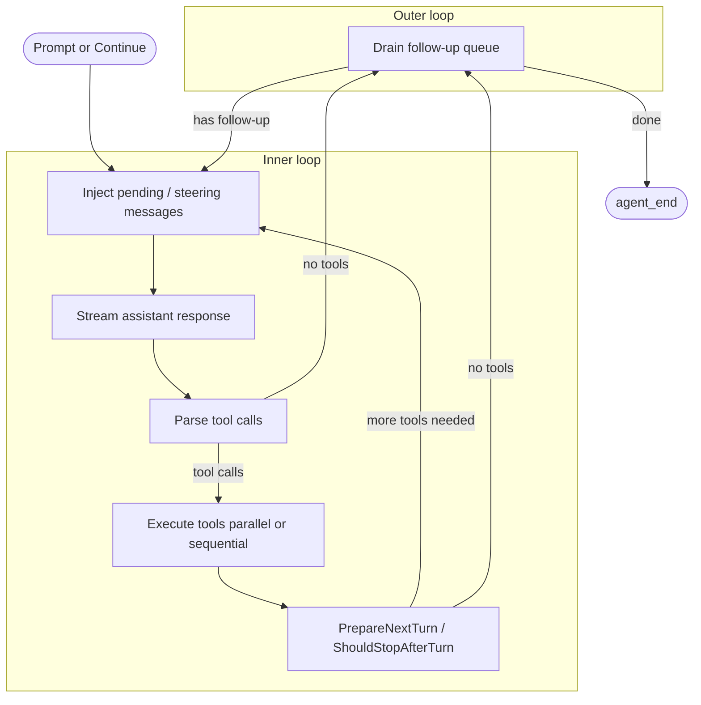
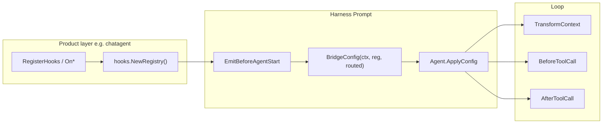
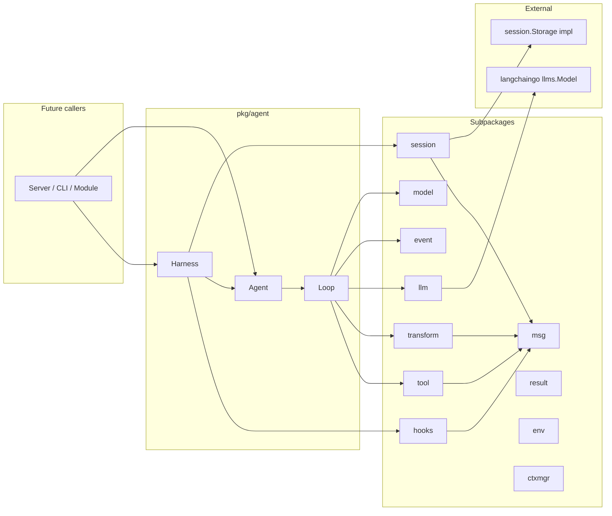
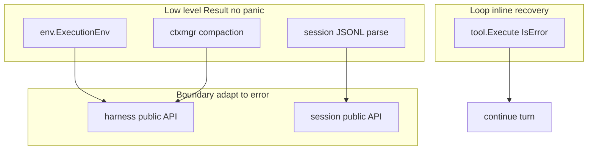

# Agent Engine Architecture

Reference implementation: [pi-agent-core](https://github.com/earendil-works/pi-agent) (TypeScript). Flowbot's Go port lives in `pkg/agent/` with langchaingo at the LLM boundary only.

## Position in Flowbot

```
Layer 3 — Business Logic
├── internal/modules/     # HTTP modules, cron, webhooks
├── pkg/workflow/       # DAG workflow runtime
├── pkg/pipeline/       # Event-driven pipelines
└── pkg/agent/          # Agent loop and LLM (pkg/agent/llm)
```

Modules that need one-shot classification or summarization import `pkg/agent/llm`. Callers that need tool loops, branching sessions, or streaming lifecycle events use the full `pkg/agent` runtime.

## Three-Layer Design

The runtime separates concerns the same way pi-agent-core does:

```
┌─────────────────────────────────────────────────────────┐
│  Harness (pkg/agent/harness)                            │
│  Session persistence, tool registry, lifecycle hooks    │
└──────────────────────────┬──────────────────────────────┘
                           │
┌──────────────────────────▼──────────────────────────────┐
│  Agent (pkg/agent/agent.go)                             │
│  Stateful wrapper: queues, subscribe, abort             │
└──────────────────────────┬──────────────────────────────┘
                           │
┌──────────────────────────▼──────────────────────────────┐
│  Loop (pkg/agent/loop.go, loop_inner.go)                │
│  Stateless Observe-Think-Act cycle                        │
└───────────────────────────────────────────────────────────┘
```

| Layer | Responsibility |
| ----- | -------------- |
| **Loop** | Send context to LLM, parse tool calls, execute tools, append results, repeat until done |
| **Agent** | Hold `Context`, steering/follow-up queues, `Subscribe()` handlers, cancellation |
| **Harness** | Wire session `Storage`, register tools, bridge `pkg/agent/hooks` into loop `Config`, gate concurrent runs |

## Observe-Think-Act Loop



### Loop controls

| Control | Config / behavior |
| ------- | ----------------- |
| **Max steps** | `Config.MaxSteps` (default 50) — prevents runaway self-iteration |
| **Cancellation** | `context.Context` — aborts LLM streaming and tool execution |
| **Tool batch mode** | `ToolExecutionParallel` (default) or `ToolExecutionSequential` |
| **Steering** | `Agent.Steer()` — inject messages between inner-loop turns |
| **Follow-up** | `Agent.FollowUp()` — inject after inner loop completes |

## Message Pipeline

Agent messages are **not** sent directly to the LLM. Two conversion stages mirror pi-agent-core:

```
[]msg.AgentMessage
    → TransformContext (optional hook)
    → []msg.AgentMessage
    → ConvertToLLM (default: transform.DefaultConvertToLLM)
    → []llms.MessageContent
    → langchaingo GenerateContent
```

Custom message types (`CustomMessage`, `BranchSummaryMessage`, `CompactionSummaryMessage`) are filtered or converted to user-visible text before the provider call. UI-only custom messages use `DisplayOnly` or `ExcludeFromContext`.

Shared types live in `pkg/agent/msg/` to avoid import cycles between `agent`, `tool`, `transform`, and `event`.

## Tool System

```
tool.Registry
  ├── Register(Tool)           # name must be unique
  ├── SetActive([]string)     # allowlist; empty = all registered
  └── ActiveTools()            # → []llms.Tool via tool.BuildLLMTools

tool.ExecuteBatch
  ├── prepareCall (sequential) # validate args, BeforeToolCall hook
  ├── execute (parallel/seq) # Tool.Execute(ctx, id, args, onUpdate)
  └── afterToolCall hook       # patch result, terminate hint
```

On failure, the executor appends a `ToolResultMessage` with `IsError: true` so the model can self-correct. Missing tools produce an error result referencing `msg.ErrToolNotFound`.

Reference tool: `pkg/agent/example/echo/`.

## Session Tree

Sessions are **append-only trees**, not linear chat arrays. Each node has `ID`, `ParentID`, and a typed entry:

| Entry type | Purpose |
| ---------- | ------- |
| `message` | User / assistant / tool result |
| `model_change` | Record model switch |
| `active_tools_change` | Record tool allowlist |
| `branch_summary` | Context after rollback to a branch |
| `compaction` | Summarized history; rebuilt via `BuildContext` compaction boundaries |

```
root ──► user msg ──► assistant ──► tool result ──► leaf
  │
  └──► (MoveTo + summary) ──► branch_summary ──► new user msg ──► leaf'
```

- **`session.Storage`** — persistence interface; core never writes files directly
- **`session.MemoryStorage`** — in-memory implementation for tests
- **`session.SerializeSession` / `DeserializeSession`** — JSONL marshal helpers (sonic)

`session.BuildContext(path)` reconstructs `[]msg.AgentMessage` and model/tool state from a branch path, honoring compaction boundaries via `first_kept_entry_id`.

## Persistent memory (chatagent)

Orthogonal to short-term session context and to user-authored **Knowledge**:

| Layer | Store | Behavior |
| ----- | ----- | -------- |
| Fact memory | `agent_memory_facts` | Tools `memory_set`/`get`/`list`/`delete`; injectable pinned+recent facts in `<memory_facts>`; scope `default` shared across interactive chats |
| Session summaries | `agent_session_summaries` | Generated on archive via `OnSessionArchived`; tool `search_session_summaries` (ContainsFold, not tsvector); not auto-injected |

## Context Management

Long-running sessions are kept within model limits by `pkg/agent/ctxmgr`:

| Component | Role |
| --------- | ---- |
| `ctxmgr.Manager` | Threshold checks, compaction, branch summarization, agent state reload |
| `ctxmgr.ShouldCompact` | Triggers when `tokens > contextWindow - reserveTokens` |
| `ctxmgr.RunCompaction` | LLM summary of discarded history; persists `EntryCompaction` |
| `ctxmgr.IsContextOverflowErr` | Detects provider overflow errors for multi-level compact retry |

Harness integration (`harness.Options.ContextManager`):

- **Before run**: `EnsureWithinBudget` compacts when over threshold
- **After overflow**: L1 `CompactAndReload(Force:false)` → L2 `Force:true` → fail
- **MoveTo**: auto branch summarization when summary is empty

Configuration:

- Per-model context limits in the built-in catalog at `pkg/agent/model/catalog.go`
- Unknown models fall back to `model.DefaultContextWindow` (128000)
- `chat_agent.compaction` for `enabled`, `reserve_tokens`, `keep_recent_tokens`

## Dual-Model Routing

`model.Router` selects between a fast **chat** model and a capable **tool** model:

```go
router := model.NewRouter("gpt-4o-mini", "gpt-4o")
router.Select(afterToolExecution bool)
```

When `Config.ChatModel` and `Config.ToolModel` are both set and differ, the loop installs a default `PrepareNextTurn` hook that applies the router after each turn (tool execution flips to `ToolModel`).

YAML configuration for the chat assistant:

```yaml
chat_agent:
  chat_model: "gpt-4o-mini"
  tool_model: "gpt-4o"
```

The chat agent is enabled when `chat_model` is non-empty. Dual routing is enabled when `tool_model` is set; both models must be registered in `models[]` with the same provider (v1). Compaction continues to use the chat model. Runtime `Harness.SetModel()` does not participate in router save-points in v1.

Callers can override routing entirely via `Config.PrepareNextTurn`.

## Event Stream

Low-level lifecycle events (`pkg/agent/event`):

```
agent_start → turn_start → message_start/end
           → tool_execution_start/update/end
           → turn_end → agent_end
```

`event.Stream` exposes a buffered channel plus `Subscribe()` handlers invoked sequentially (settlement semantics aligned with pi-agent-core). Use `Agent.Subscribe()` for read-only progress UI; use typed hooks when you need to mutate loop behavior.

## Hooks (`pkg/agent/hooks`)

Typed extension points aligned with [pi-agent](https://github.com/earendil-works/pi-agent) harness hooks. Handlers register on a per-run `hooks.Registry`; the harness bridges loop-affecting hooks into `msg.Config` before each `Prompt`.



### Bridge sequence (each `Harness.Prompt`)

1. `EmitBeforeAgentStart` — may replace `messages` / `systemPrompt`; `Cancel` → `hooks.ErrRunCancelled`
2. `prepareContext` — compaction when `ContextManager` is set
3. `model.ApplyDefaultRouter(loopBaseCfg)` — dual-model `PrepareNextTurn` (idempotent; snapshot taken at harness `New`)
4. `hooks.BridgeConfig(ctx, reg, routed)` — compose hook handlers onto loop callbacks (**only when `HasLoopHandlers()`**)
5. `Agent.ApplyConfig` — merge hook fields; preserve steering/follow-up queue drains

`Observe` handlers do **not** enter `BridgeConfig`; they receive harness notifications only (`save_point`, `context_usage`, etc.).

### Event types and reducers

| Constant | Registrar | When | Reducer |
| -------- | --------- | ---- | ------- |
| `before_agent_start` | `OnBeforeAgentStart` | Before loop starts | Chain `systemPrompt`; replace `messages`; `Cancel` aborts |
| `context` | `OnContext` | Before each LLM call | Chain message list replacements |
| `tool_call` | `OnToolCall` | Before tool execute | First `Block` wins |
| `tool_result` | `OnToolResult` | After tool execute | Chain `Parts` / `IsError`; `Terminate` ends loop |
| `save_point`, `context_usage`, `context_compacted`, `model_update`, `tools_update` | `Observe` / `OnObservation` | Harness lifecycle | Read-only; errors logged, run continues |

Loop-level `Config` fields (`TransformContext`, `BeforeToolCall`, …) remain available for tests and direct `RunLoop` callers. Harness hook handlers are composed **after** any existing `Config` callbacks (`Chain*` in `hooks/compose.go`).

### Errors

| Error | When |
| ----- | ---- |
| `hooks.ErrRunCancelled` | `before_agent_start` returned `Cancel: true` |
| `agent.ErrAborted` | Harness busy, user `Abort()`, or context cancelled mid-run |

### Chat agent wiring

`internal/server/chatagent` creates one `hooks.Registry` per run, calls `RegisterHooks` (permission, path sensors, progress injection, optional lint observation), and passes `harness.Options.Hooks`. See [Developer Guide — Typed Hooks](./developer-guide.md#typed-hooks-pkgagenthooks).

## Reliability and Observability

| Concern | Implementation |
| ------- | -------------- |
| LLM transient retry | `pkg/agent/llm` + `pkg/backoff`; retries only before any stream delta is delivered |
| Overflow degrade | Harness `watchStream`: L1 `CompactAndReload(Force:false)` → L2 `Force:true` → fail; `result.WrapOverflowError` |
| Tool arg validation | `tool.ValidateArgs` (required + top-level types) before execute |
| Actionable tool errors | `tool.FormatToolError` / `tool.ErrorResult` |
| Path sensors | `OnToolResult` workspace path re-check in chatagent |
| Metrics | `pkg/metrics.AgentCollector` (low-cardinality labels); OTel spans `agent.run` / `agent.llm.stream` / `agent.tool.*` / `agent.compact` |
| Progress artifact | `{workspace}/.flowbot/progress.md` injected via `OnContext` (≤500 tokens) |
| Dynamic tools | `ApplyToolScope` — plan readonly; normal excludes schedule unless intent/RunKind |
| Sandbox | Opt-in Docker `pkg/agent/sandbox` for `run_terminal` / `run_code` |
| DCG guard | Always-on pre-permission check via `pkg/agent/dcg` (`dcg --robot test`) for `run_terminal` / `run_code`; requires `dcg` on `PATH` (bundled in [`deployments/Dockerfile`](../../deployments/Dockerfile) and the agent-sandbox image); embedded packs in `pkg/agent/dcg/config.toml`; no agent bypass |
| Eval | `pkg/agent/eval` FakeModel suite (`go test ./pkg/agent/eval/...`) |

## LLM Layer

`pkg/agent/llm` wraps langchaingo only:

| File | Role |
| ---- | ---- |
| `factory.go` | Map `config.Model` → OpenAI / Anthropic / Gemini langchaingo clients |
| `stream.go` | `StreamAssistant()` — streaming + tool call assembly + pre-stream retry |
| `retry.go` | `IsRetryableLLMError`, `RetryConfig` |
| `fake.go` | Scriptable `llms.Model` for unit tests and BDD |

**Not used:** langchaingo `agents.Executor`, chains, or memory modules.

## Package Dependency Graph



`msg` is the shared leaf package; no subpackage imports the root `agent` package.

## Error Flow

Expected failures during long-running agent execution use a discriminated Result model (aligned with pi-agent):



| Layer | Mechanism |
| ----- | --------- |
| `result`, `env`, `ctxmgr` | `result.Result[T,E]` with typed codes |
| `harness`, `session` API | Go `error`; `HarnessError` at boundary |
| Tools | `ToolResultMessage.IsError` |
| Loop | Fatal `error` aborts run |

## Design Rules

1. **Loop is stateless** — test with `RunLoop` + `FakeModel` without `Agent` or `Harness`
2. **Core does not touch the filesystem** — JSONL helpers only; callers provide `Storage`
3. **Modules import `pkg/agent/llm` only** — for single-shot LLM tasks; other `pkg/agent` packages stay core-only until wired to server
4. **Serialization** — sonic for JSON/JSONL and tool argument parsing
5. **Errors** — domain errors in `msg`: `ErrMaxSteps`, `ErrAborted`, `ErrToolNotFound`, `ErrEmptyContext`, `ErrInvalidContinue`; hook cancel via `hooks.ErrRunCancelled`
6. **Naming** — do not confuse with instruct agent protocol or YAML `chat_agent` config

## Related Documentation

- [Developer Guide](./developer-guide.md) — API examples and extension points
- [pkg/agent/AGENTS.md](../../pkg/agent/AGENTS.md) — maintainer checklist
- [Architecture diagrams](../architecture/) — system-wide PlantUML
- [TDD specs](../testing/tdd-specs.md) — unit test conventions
- [BDD specs](../testing/bdd-specs.md) — `tests/specs/agent_spec_test.go`
