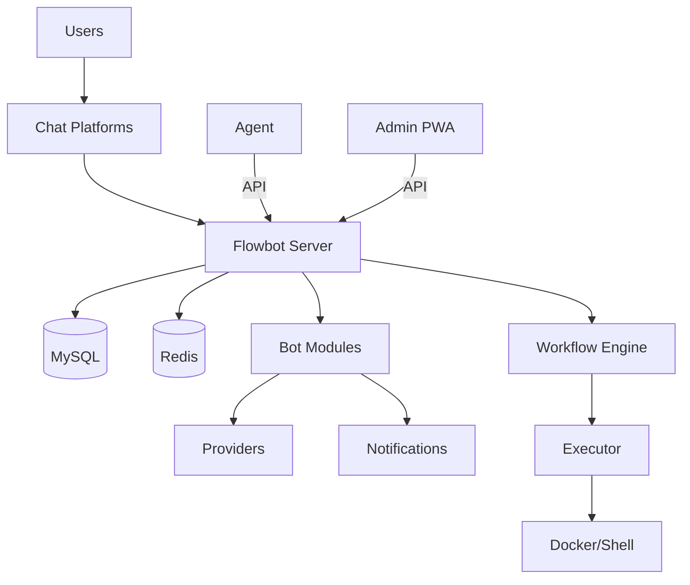

# System Architecture

This directory contains system architecture design documentation and diagrams for Flowbot.

## File Descriptions

### `architecture.png`

Overall system architecture diagram showing relationships between components and data flow.

### `flowchart.mermaid`

Workflow flowchart described using Mermaid syntax, can be rendered in Mermaid-supported editors.

## System Architecture Overview

Flowbot uses a modular architecture with multiple entry points and shared libraries.

### Entry Points (`cmd/`)

| Binary | Description |
|--------|-------------|
| `cmd/main.go` | Main server — API, chatbot, workflow engine (Fiber v3 + fx DI) |
| `cmd/agent/` | Desktop agent — background tasks, script engine, system tray |
| `cmd/app/` | Admin PWA — WebAssembly frontend + Fiber server (go-app/v10) |
| `cmd/composer/` | CLI tool — code generation, migration, workflow import |

### Core Components

1. **Flowbot Server** (`internal/server/`)
   - RESTful API with Swagger docs
   - Platform callbacks (Discord, Slack, Tailchat)
   - MCP (Model Context Protocol) handler
   - OAuth, webhook, media, and event routing
   - Health probes (`/livez`, `/readyz`, `/startupz`)
   - Prometheus metrics (`/metrics`)

2. **Bot Modules** (`internal/bots/`)
   - 18 specialized bot modules (agent, anki, bookmark, clipboard, cloudflare, dev, finance, gitea, github, kanban, notify, reader, search, server, torrent, user, webhook, workflow)
   - Each bot registers its own rules, commands, and webservice routes

3. **Flowbot Agent** (`cmd/agent/`)
   - Desktop automation and background tasks
   - Script engine with file system watching
   - System metrics collection
   - Auto-updater
   - Communicates with server via API

4. **Admin PWA** (`cmd/app/`)
   - WebAssembly frontend built with go-app/v10
   - DaisyUI + Tailwind CSS styling
   - Pages: Dashboard, Containers, Settings, Login
   - Separate Dockerfile for deployment (`deployments/Dockerfile.app`)

5. **Workflow Engine** (`internal/bots/workflow/`)
   - DAG-based workflow execution
   - Built-in actions: Message, Fetch, Feed, LLM, Docker, Grep, Unique, Torrent
   - Trigger types: manual, webhook, cron
   - Job scheduling and step tracking

### Platform Layer (`internal/platforms/`)

| Platform | Directory |
|----------|-----------|
| Discord | `discord/` |
| Slack | `slack/` |
| Tailchat | `tailchat/` |

### Storage Layer (`internal/store/`)

- **Database**: MySQL (primary), with migration support (51 migrations)
- **Cache**: Redis (sessions, pub/sub, locking)
- **Media**: File system or MinIO object storage
- **Models**: Auto-generated DAO via GORM Gen

### Provider Integrations (`pkg/providers/`)

17 third-party service integrations:

| Category | Providers |
|----------|-----------|
| Development | GitHub, Gitea, Drone CI |
| Communication | Slack, Email |
| Infrastructure | AdGuard, Cloudflare, Uptime Kuma |
| Productivity | Kanboard, n8n |
| Finance | Firefly III |
| Media | Transmission, Miniflux, ArchiveBox, Hoarder |
| Storage | Dropbox |
| Other | Slash |

### Notification System (`pkg/notify/`)

| Provider | Description |
|----------|-------------|
| Slack | Channel/user notifications |
| Pushover | Mobile push notifications |
| ntfy | Self-hosted push notifications |
| Message Pusher | Custom internal notifications |

### Shared Packages (`pkg/`)

| Package | Purpose |
|---------|---------|
| `chatbot` | Bot interface and registration |
| `config` | Configuration loading |
| `crawler` | Web crawling and scraping |
| `event` | Redis-based pub/sub event system |
| `executor` | Docker/shell execution runtime |
| `flows` | Flow validation and ingredients |
| `flog` | Structured logging (Zerolog) |
| `media` | File storage abstraction |
| `parser` | Command/syntax lexer and parser |
| `route` | Bot route definitions |
| `search` | MeiliSearch integration |
| `types` | Shared type definitions |
| `utils` | Common utilities |

## Data Flow

## Deployment

### Docker Images

| Image | Dockerfile | Description |
|-------|-----------|-------------|
| `flowbot` | `deployments/Dockerfile` | Main server |
| `flowbot-app` | `deployments/Dockerfile.app` | Admin PWA (multi-stage: Wasm + server) |

### CI/CD Workflows (`.github/workflows/`)

| Workflow | Description |
|----------|-------------|
| `build.yml` | Build main server |
| `build_agent.yml` | Build agent |
| `build_app.yml` | Build admin PWA + Docker image |
| `docker.yml` | Docker image publishing |
| `release.yml` | Release pipeline |

### Systemd Service

Agent can be deployed as a systemd service — see `docs/deployment/flowbot-agent.service`.

## Security

- OAuth 2.0 integration (Slack, etc.)
- API key authentication (`X-AccessToken` header)
- JWT token-based admin panel auth
- HTTPS/TLS support
- Sensitive data encrypted storage

## Monitoring

- Prometheus metrics at `/metrics`
- Structured logging with Zerolog
- Health check probes (`/livez`, `/readyz`, `/startupz`)
- Automatic GOMAXPROCS tuning (`automaxprocs`)
