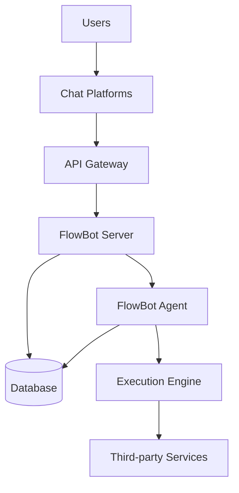

# System Architecture

This directory contains system architecture design documentation and diagrams for FlowBot.

## File Descriptions

### `architecture.png`

Overall system architecture diagram showing relationships between components and data flow.

### `flowchart.mermaid`

Workflow flowchart described using Mermaid syntax, can be rendered in Mermaid-supported editors.

## System Architecture Overview

FlowBot adopts a microservices architecture with the following main components:

### Core Components

1. **API Gateway**

   - Unified API entry point
   - Request routing and load balancing
   - Authentication and authorization

2. **FlowBot Server**

   - Main business logic processing
   - RESTful API service
   - Core chatbot functionality

3. **FlowBot Agent**

   - Background task executor
   - Workflow scheduling and execution
   - Scheduled task management

4. **Database Layer**
   - MySQL/PostgreSQL data storage
   - Relational data management
   - Transaction and consistency guarantees

### External Integrations

1. **Chat Platforms**

   - Discord
   - Slack
   - Tailchat
   - Other custom platforms

2. **Third-party Services**
   - Notification services (Pushover, Slack, etc.)
   - File storage services
   - External API integrations

### Workflow Engine

1. **Rules Engine**

   - Rule parsing and execution
   - Condition evaluation and routing
   - Dynamic rule loading

2. **Task Scheduler**

   - Task queue management
   - Concurrency control
   - Failure retry mechanism

3. **Execution Engine**
   - Workflow step execution
   - State tracking
   - Result collection

## Data Flow Architecture

## Deployment Architecture

### Single-node Deployment

Suitable for small-scale usage or development environments:

- FlowBot Server + Agent in same process
- Single database instance
- Local file storage

### Distributed Deployment

Suitable for production environments:

- Multiple Server instances with load balancing
- Multiple Agent instances for task distribution
- Database master-slave replication
- Distributed file storage

### Containerized Deployment

Using Docker and Kubernetes:

- Containerize all components
- Auto-scaling
- Service discovery and configuration management
- Health checks and self-healing

## Security Architecture

### Authentication and Authorization

- JWT Token authentication
- RBAC permission control
- OAuth 2.0 integration
- API Key management

### Data Security

- Data transmission encryption (HTTPS/TLS)
- Database connection encryption
- Sensitive data encrypted storage
- Access log auditing

### Network Security

- Firewall rules
- VPC network isolation
- DDoS protection
- Intrusion detection

## Monitoring and Operations

### Monitoring Metrics

- System performance metrics (CPU, memory, disk)
- Application business metrics (request volume, response time, error rate)
- Database performance metrics
- Workflow execution statistics

### Log Management

- Structured log format
- Centralized log collection
- Log rotation and archiving
- Real-time log analysis

### Alerting Mechanism

- System exception alerts
- Business metric alerts
- Automated fault handling
- Alert escalation mechanism

## Scalability Design

### Horizontal Scaling

- Stateless service design
- Database sharding
- Cache layer optimization
- Message queue decoupling

### Plugin Mechanism

- Bot plugin system
- Rules engine extensions
- Notification channel extensions
- Custom function support
