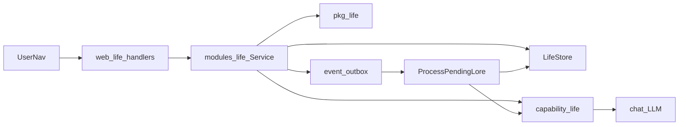

# Life Architecture

Product narrative: [`templ/prd.md`](../../templ/prd.md). This document is the Flowbot implementation contract.

## 1. Position in Flowbot

```text
Layer 3 — Business Logic
├── internal/modules/life/   # Use-case orchestration, seeds, lore outbox consumer
├── pkg/life/                # Pure formulas (cascade, loot, buffs)
└── pkg/capability/life/     # LLM quest evaluation and lore generation

Layer 2 — Capability
└── capability.Invoke(hub.CapLife, …) → LLM adapter

Layer 1 / 0 — Store + infra
└── life_* tables via LifeStore / ent; event_outbox for async lore
```

HTML UI lives in `internal/modules/web` under `/service/web/life*` (same pattern as hub/workflow pages).

## 2. Package map

```text
internal/modules/life/          # Service, Bootstrap, outbox consumer, config
internal/modules/life/seed/     # embed JSON (equipment, loot tables)
internal/modules/fx.go          # Register()
pkg/life/                       # cascade, loot, buffs (no I/O)
pkg/capability/life/            # EvaluateQuest, GenerateInstanceLore
internal/store/ent/schema/      # life_*.go (int64 PK + string flag)
internal/store/life.go         # LifeStore facade (package store)
internal/store/postgres/        # only if methods are on Adapter (prefer LifeStore)
internal/modules/web/           # life_*_webservice.go; SetLifeService via life.OnService
pkg/views/pages|partials/       # life_*.templ
public/js/life-radar.js         # Character radar chart
public/css/custom.css           # Life page styles (`.life-*`)
```

## 3. Identity model

- Platform `users` table is unchanged (account only).
- `life_profiles` is 1:1 with the signed-in web operator.
- `life_profiles.user_id` = web session UID from `authenticateWeb` / `route.RequestContext.UID` (string, e.g. `user-admin`).
- All domain rows FK to `life_profile_id` (int64), not platform user id.

## 4. Deviations from PRD

| PRD | Implementation |
| --- | -------------- |
| UUID primary keys | int64 PK + string `flag` (`types.Id()`) — repo convention |
| `UserInventory.is_equipped` | Removed; wear state only in `life_equipped_slots` |
| Pity counter entity missing | `life_profiles.pity_by_tier` JSON map |
| Unique memorial gear as new Equipment rows | Inventory instance overrides (`instance_name`, `instance_lore`, `instance_buffs`) |
| Equipment rust logic | Fail quest applies 24h `tarnished_until`; buffs ignored while active; Complete clears rust |
| Sync AI lore on drop | Sync drop + outbox; lore filled async |
| Full AI always | `EvaluateQuest` / `GenerateInstanceLore` require chat LLM; errors surface to caller |
| AIContext unused | Loaded into EvaluateQuest (personality, completion rate, mood) |
| Gear AI privilege unused | Equipped `ai_unlocked_privilege` merged into EvaluateQuest |
| LifeGoal CRUD | Create / edit / pause / delete on Character; optional `goal_flag` on quest create |
| Drop rate preview | Toast on create + pending card `~N% drop` |
| AI lore on every drop | Lore outbox only for Boss quests or difficulty SS/SSS |

## 5. ER / tables

| Table | Role |
| ----- | ---- |
| `life_profiles` | level, exp, gold, class_type, base_drop_rate_bonus, pity_by_tier |
| `life_characteristics` | INT / PHY / WIL / CHA / CRE / FIN / WRI / FOC per profile |
| `life_skills` | skills under a characteristic |
| `life_goals` | PARA LifeGoal |
| `life_quests` | One-Time / Daily / Boss quests; stores AI `title` plus original user `prompt` |
| `life_ai_contexts` | DM personality + mood JSON (1:1 profile) |
| `life_equipments` | Catalog templates (seeded) |
| `life_inventories` | Owned instances + instance overrides + lore_status |
| `life_equipped_slots` | One row per profile; slot → inventory id |
| `life_loot_tables` | drop_tier → base chance + item flag pool |
| `life_action_logs` | completion + dice + drop audit |

Reserved on inventory/slots: `tarnished_until` (nullable time). Lore: `lore_status` ∈ `none` \| `pending` \| `ready` \| `failed`.

## 6. Service and capability API

**LifeService** (`internal/modules/life`):

| Method | Purpose |
| ------ | ------- |
| `EnsureProfile` | Create profile + seed characteristics + empty slots/ai context |
| `CreateQuestFromPrompt` | Evaluate via capability → persist quest |
| `CompleteQuest` | Cascade + loot + action log + optional lore outbox + Daily respawn (one DB tx) |
| `UpdateGoal` / `DeleteGoal` | Edit or remove PARA goals |
| `ListActionLogs` | Recent completion audit for Quests UI |
| `Equip` / `Unequip` | Update `life_equipped_slots` |
| `ListQuests` / `ListInventory` / `GetCharacter` | Read models for UI |
| `SetClassType` | Update class (default `Architect`) |
| `ProcessPendingLore` | Outbox consumer for lore (retries on LLM failure) |

**Capability** (`hub.CapLife`):

| Op | Purpose |
| -- | ------- |
| `EvaluateQuest` | LLM JSON eval → difficulty, fear, rewards, drop_tier, skill/stat |
| `GenerateInstanceLore` | LLM JSON → instance name/lore for dropped gear |

## 7. Bootstrap / seeds

- `EnsureProfile`: seed (and backfill) characteristics `INT`, `PHY`, `WIL`, `CHA`, `CRE`, `FIN`, `WRI`, `FOC`; `class_type=Architect`; empty equipped slots + AI context.
- Skills: `GetOrCreate` on evaluate/create (no default skill list).
- `Bootstrap`: idempotent upsert of equipment + loot tables from `internal/modules/life/seed/*.json`.

## 8. HTTP routes and User nav

Prefix: `/service/web`

| Method | Path | Purpose |
| ------ | ---- | ------- |
| GET | `/life` | Dashboard |
| GET | `/life/character` | Stats, class, goals, equipped |
| POST | `/life/character/class` | Set class type |
| POST | `/life/goals` | Create goal |
| POST | `/life/goals/:flag` | Update goal title/category |
| POST | `/life/goals/:flag/status` | Pause / activate goal |
| POST | `/life/goals/:flag/delete` | Delete goal |
| GET | `/life/quests` | Quest list |
| POST | `/life/quests` | Create quest from prompt |
| POST | `/life/quests/:flag/complete` | Complete quest (cascade + loot) |
| POST | `/life/quests/:flag/fail` | Fail quest (24h gear rust) |
| GET | `/life/inventory` | Backpack |
| POST | `/life/inventory/:flag/equip` | Equip inventory item |
| POST | `/life/inventory/slots/:slot/unequip` | Clear equipped slot |

Nav: session badge User dropdown — Life, Character, Quests, Inventory. Mirror under a **User** section in the mobile menu. Logout stays as today.

## 9. Core flows and outbox contract



### Create quest

Web → `CreateQuestFromPrompt` → `capability.Invoke(EvaluateQuest)` → get-or-create skill → insert `life_quests`.

### Complete quest

In one transaction:

1. Mark quest completed.
2. Apply `pkg/life` cascade (skill → characteristic → profile).
3. Roll loot with pity; maybe insert inventory.
4. Write `life_action_logs`.
5. If drop needs lore (Boss, or difficulty SS/SSS): set `lore_status=pending`, append `event_outbox`.
6. If quest type is `Daily`, insert a fresh Pending clone (same title/prompt/rewards).

HTMX returns immediate feedback (exp/gold/drop). Lore fills later. Completion-rate blend runs after commit.

### Outbox

- Event type string: `life.inventory.lore_requested`
- Payload: `event_id`, `type`, `life_profile_id`, `inventory_id`
- Consumer: `modules/life` `ProcessPendingLore` (poll unpublished outbox rows of this type)
- On success: set instance lore fields, `lore_status=ready`, mark outbox published
- On LLM / transient failure: leave outbox unpublished for retry; do not mark `lore_status=failed`
- On poison / malformed payload / malformed lore response / missing inventory: mark outbox published; if inventory is known and still `pending`, set `lore_status=failed`

## 10. Boundaries

- Modules must not import `pkg/providers/*`.
- Web handlers must not run ent queries; call `LifeService` only.
- Formulas only in `pkg/life`.
- Persistence: `LifeStore` in package `store` (`internal/store/life.go`; not a separate `*_store.go` package); schemas `life_*`.
- No JSON API under `/service/life` in v1.
- Web installs the domain service via `life.OnService(web.SetLifeService)` at module register time.

## 11. Config

```yaml
modules:
  - name: life
    enabled: true
    default_class: Architect
```

## 12. Testing notes

- `pkg/life`: table-driven unit tests (cascade, loot, pity, buffs).
- Module / web: package tests with fakes where needed.
- Cross-boundary BDD under `tests/specs/life_spec_test.go` (requires Docker).

## 13. Implementation status

Implemented in-tree: schemas (`life_*`), `LifeStore`, `pkg/life`, `pkg/capability/life`, `internal/modules/life`, web routes/UI, User nav, seed catalog, BDD specs.
